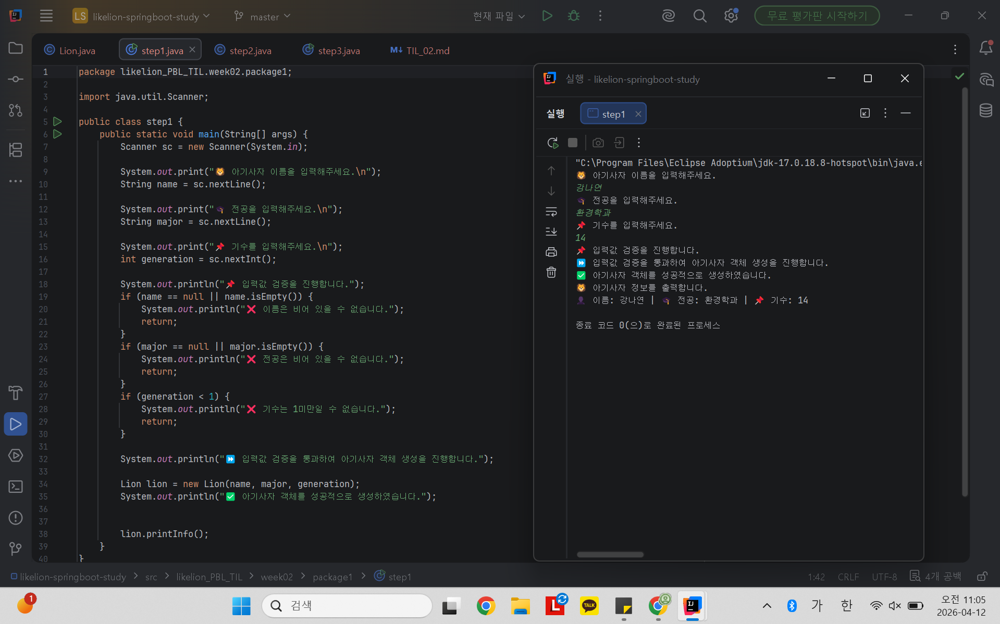
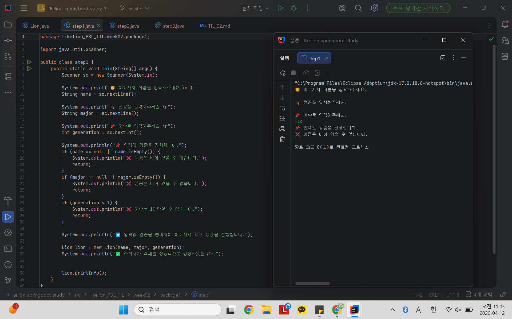
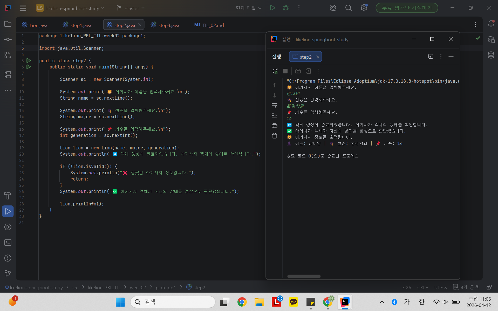
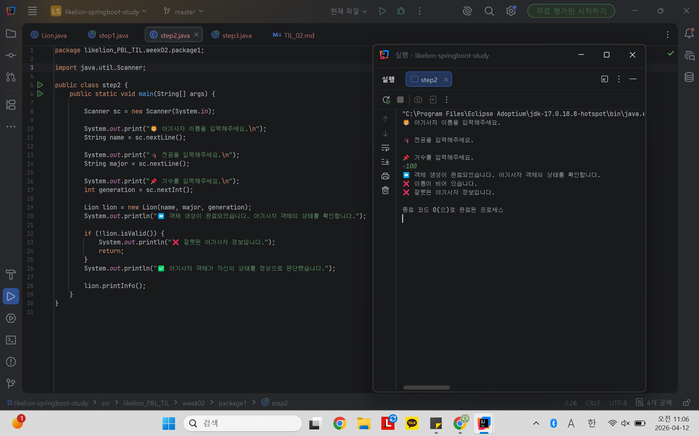
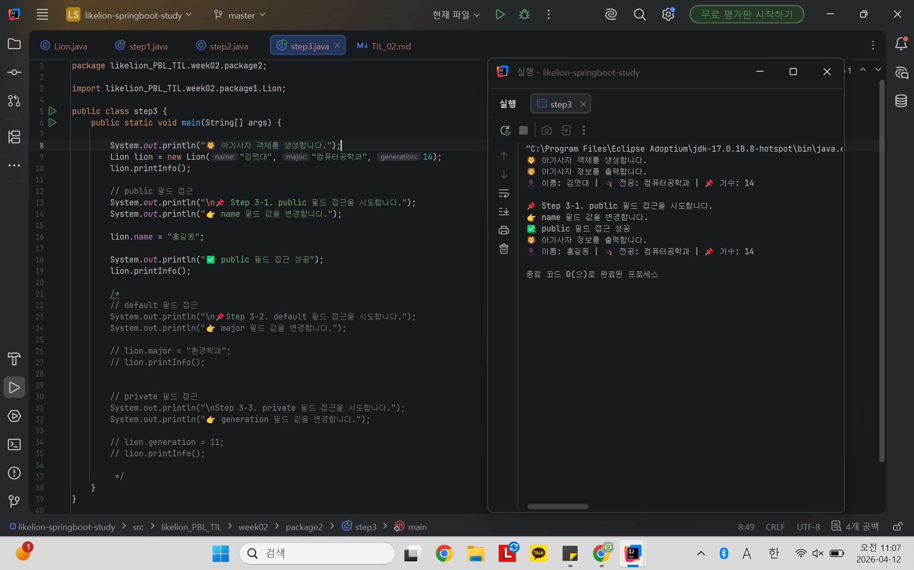
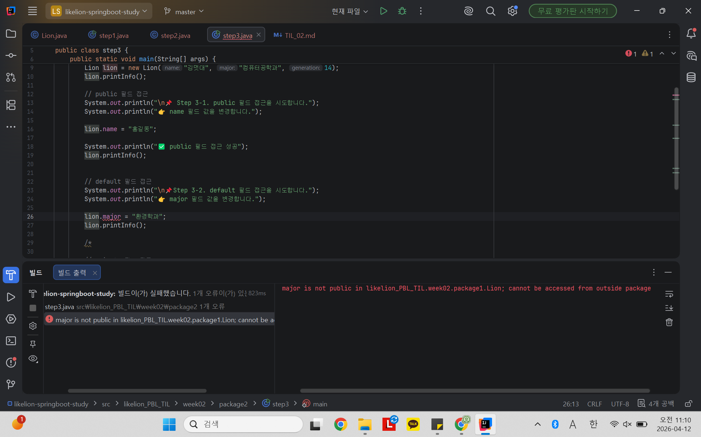
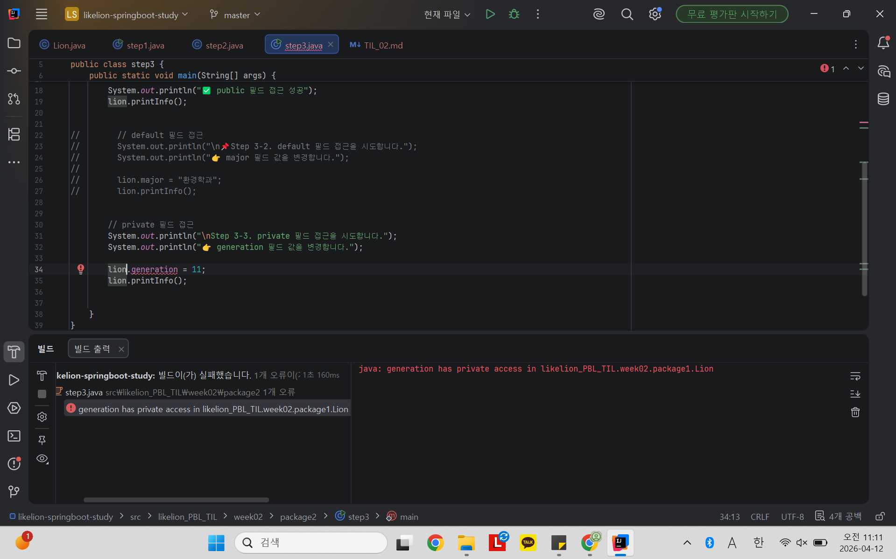

# 📘 Today I Learned
2026.04.11

## 1. 오늘 배운 내용
- 클래스와 객체
- 캡슐화
- 접근제어자
- 유효성 검증
- 필드, 생성자, 메서드

## 2. 핵심 정리 (내 언어로)
- 객체지향에서 중요한 것은 사물의 공통 특징을 묶어내는 것
- 클래스는 설계도, 객체는 실제 물건, 필드는 객체가 가지고 있는 데이터
- 메서드는 객체가 할 수 있는 행동, 생성자는 객체를 만들 때 실행되는 특별한 메서드
- 캡슐화는 객체의 내부 데이터를 외부로부터 보호하고, 필요한 경우에만 메서드를 통해 접근하도록 제한하는 것이다.
- 접근 제어자는 클래스, 필드, 메서드에 대한 접근 가능 범위를 제한하여 데이터를 보호하는 키워드이다.
- public은 어디서든 접근 가능, default는 같은 패키지 내에서만 접근 가능, private는 해당 클래스 내부에서만 접근 가능 (외부 접근 불가)
- main 메서드는 사용자 입력과 프로그램의 흐름을 제어하는 역할을 하고, Lion 클래스는 데이터 관리와 유효성 검증을 담당해야 한다.

## 3. 결과 이미지 (스크린샷)

### step1) 올바른 값 입력

  

### step1) 잘못된 입력값 입력

  

### step2) 올바른 값 입력

  

### step2) 잘못된 입력값 입력

  

### step3) public 필드에 접근

  

### step3) default 필드에 접근 시도

  

### step3) private 필드에 접근 시도

  

## 4. 느낀 점
- 객체지향을 시작하니 자바를 공부하는 것이 실감났다.
- 클래스를 나누어 작성하고 실행하는 과정이 신기했고 구조를 고민할 수 있는 경험이었다.
- 이번 PBL을 통해 클래스,메서드, 필드의 개념을 이해할 수 있었다.
- 지난 주보다는 java 코드 작성이 조금 편해졌지만 아직 많이 부족하다
- 보너스 문제는 미래의 나에게 선물한다.
