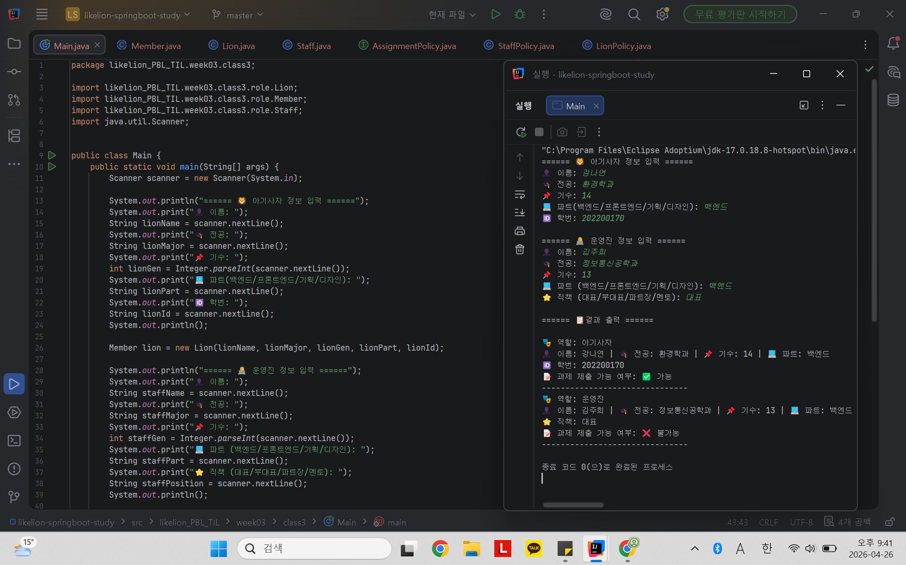

# 📘 Today I Learned
2026.04.26

## 1. 오늘 배운 내용
- 추상 클래스
- 상속
- 인터페이스
- 다형성
- @Override

## 2. 핵심 정리 (내 언어로)

- 추상 클래스는 공통 기능을 일부 구현하면서 상속을 통해 확장하는 데 사용되고, 인터페이스는 기능의 규격만 정의하여 구현을 강제하는 데 사용된다.
- 다형성: 외부에서 동일한 메서드를 호출하더라도 객체가 가진 정책 타입에 따라 서로 다른 코드가 실행되는 성질
- 위임과 다형성을 사용하여 객체가 스스로 판단하게 하여 조건문을 줄이거나 사용하지 않고 기능 구현 가능
- import (~.AssignmentPolicy 또는 ~.Member 등)로 현재 클래스가 속하지 않은 다른 패키지에 정의된 인터페이스나 클래스를 이름만으로 사용할 수 있도록 참조하는 선언
- implements: 인터페이스의 추상 메서드들을 클래스 내부에 실제로 구현할 때 사용
- extends: 부모 클래스의 속성과 메서드를 상속받아 기능을 확장할 때 사용
- Integer.parseInt(scanner.nextLine()): 한 줄 전체 입력을 문자열로 읽은 뒤 정수로 변환하며, 개행 문자까지 함께 읽기 때문에 입력 버퍼에 남지 않아 다음 입력을 바로 처리할 수 있다.
- @Override: 부모 클래스나 인터페이스에서 상속받은 메서드를 자식 클래스에서 재정의할 때 사용하는 어노테이션. 메서드 이름이나 매개변수가 정확히 일치하는지 컴파일 시 확인하여 오류를 방지
- super(): 부모 생성자 호출
- protected: 같은 패키지에서는 자유롭게 접근 가능하고, 다른 패키지에서는 상속받은 자식 클래스에서만 접근 가능하도록 제한하는 접근 제어자

## 3. 결과 이미지 (스크린샷)

## 4. 느낀 점
- 위임과 다형성을 활용한 설계를 통해 결합도를 낮추고 유지보수성과 확장성을 높일 수 있음을 이해할 수 있었으며, 객체가 스스로 판단하도록 구성하는 방식이 인상 깊었다.
- 점점 더 어렵고 복잡해지지만 그만큼 신기하고 재밌기도 했다. 복습하며 개념을 내 것으로 만들자~