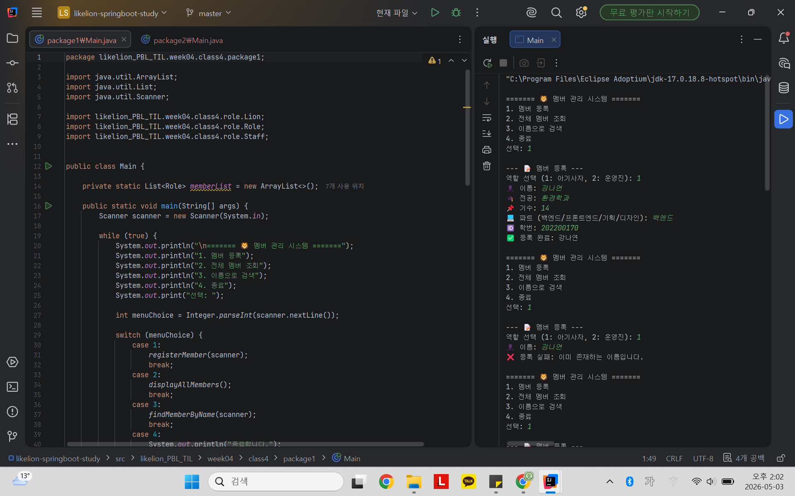
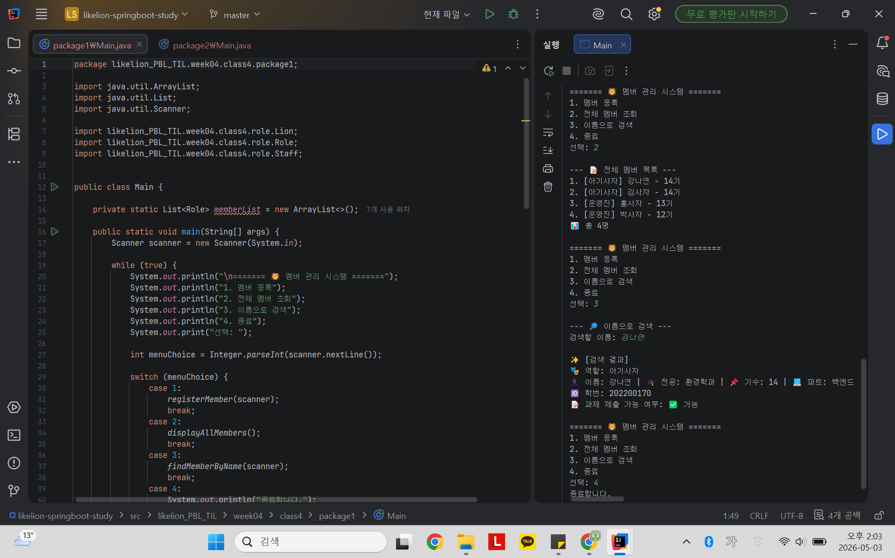
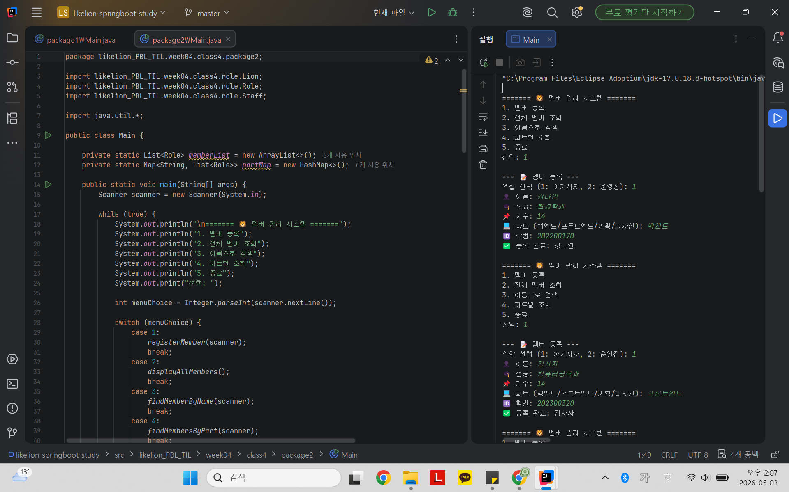
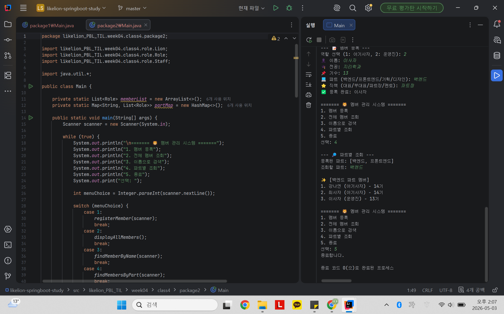

# 📘 Today I Learned
2026.05.03
  Java Collections & 설계 확장

## 1. 오늘 배운 내용
- 배열, List, Map, Method
- List와 배열의 차이
- 제네릭<>
- for - each문

## 2. 핵심 정리 (내 언어로)
- 배열은 처음 만들 때 미리 정한 크기를 바꿀 수 없지만 리스트는 데이터를 넣는 만큼 크기가 늘어남.   배열은 기본 타입과 객체를 모두 담을 수 있지만, 리스트는 객체만 담을 수 있음.
- 제네릭<> : 컬렉션에 어떤 타입의 객체를 담을지 미리 정하는 것 -> 타입 안정성, 데이터 꺼낼 때 따로 형변환 필요 없음
- for each문- for ( 타입 변수명: 컬렉션 명) : 안에 들어있는 모든 데이터를 처음부터 끝까지 알아서 하나씩 꺼내줌.
- List
  - add(): 맨 뒤에 데이터 추가, get(index): 특정 인덱스에 있는 데이터 가져옴  size(): 담긴 데이터의 총 개수, isEmpty(): 리스트 비어있으면(size()==0) true
- Hashmap
  - put(key, value): 고유한 키(Key)와 연결된 값(Value)을 메모리에 매핑하여 저장, get(key): 인덱스가 아닌 key값으로 데이터 찾기  containsKey(key): 특정 key가 맵에 존재하는지 여부, keySet():맵에 저장된 모든 Key들을 추출하여 Set 컬렉션 형태로 반환

## 3. 결과 이미지 (스크린샷)

### step1) 메뉴화면, 멤버 등록, 멤버 중복

  

### step1) 전체멤버 조회, 이름 검색

  

### step2) 메뉴화면, 멤버 등록

  

### step2) 파트별 조회

## 4. 느낀 점
- 지난 과제의 부족함을 느낄 수 있었던 시간이었다!   객체 내부의 데이터를 편리하게 가져오기 위해 getName(), getMajor(), getGeneration() 메서드를 추가하였고, 이를 통해 로직에서 데이터를 훨씬 효율적으로 활용할 수 있었다.
- 다양하게 입력값을 넣어보며 오류를 만나고 수정할 수 있었다. 모든 예외상황을 대비하진 못했지만, 직접 문제를 해결해 보며 코드를 더 견고하게 만드는 법을 익힐 수 있었다.
- 이번 과제에서 만났던 오류들 중 NullPointerException은 존재하지 않는 객체(null)의 메서드를 호출할 때 발생하는 오류 
  - 데이터가 유입되는 시점에 사전 입력 검증을 수행하고, 조건에 맞지 않을 경우 Early Return으로 즉시 로직을 종료하며 해결
