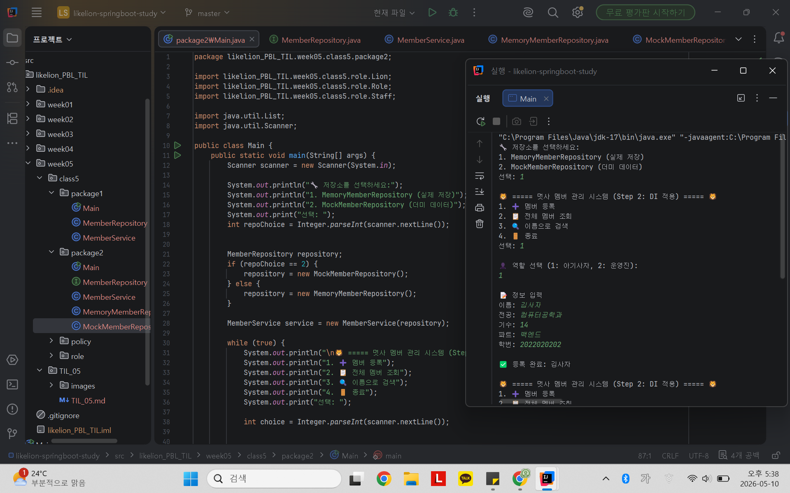
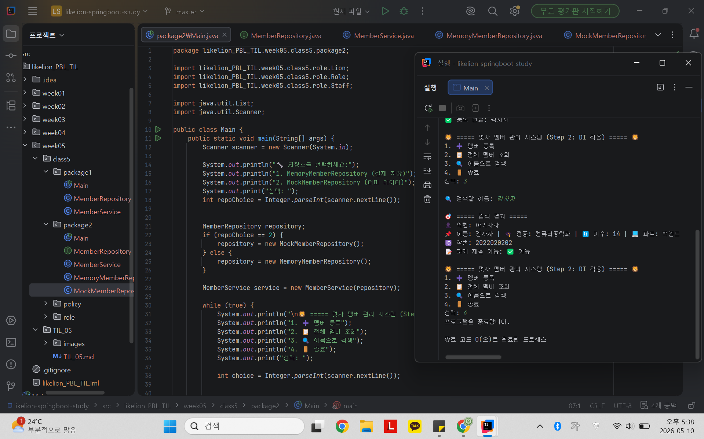

# 📘 Today I Learned
2026.05.10
  자바로 배우는 IoC / DI
## 1. 오늘 배운 내용
- DI(Dependency Injection): 의존성 주입
- IoC(Inversion of Control): 제어의 역전
- 강한 결합, 느슨한 결합
- 레이어 분리

## 2. 핵심 정리 (내 언어로)
- Repository, Service, Main 세 개의 레이어로 분리
  - 데이터 저장 및 조회 역할은 MemberRepository로 분리
  - 핵심 비즈니스 로직(멤버등록)은 MemberService로 분리
  - 사용자 입출력은 Main에 잔류
- Step1(강한 결합) - MemberService가 내부에서 new MemberRepository()를 직접 호출함. = 서비스가 저장소의 생명주기를 직접 관리 
- Step2(느슨한 결합) - MemberService는 저장소가 어떻게 생겼는지 모르고, Main에서 저장소 기능을 하는 객체를 넣어주는 것(의존성 주입)을 기다림 => 서비스가 직접 객체를 만들던 주도권이 Main에게로 넘어감 = 제어의 역전 (IoC)
  - 인터페이스와 DI를 통해 교체 유연성을 극대화함
  
## 3. 결과 이미지 (스크린샷)

### 메뉴 화면, 멤버 등록 화면

  
### 검색 결과 화면

## 4. 느낀 점
- 레이어 분리, DI, IoC를 통해 코드를 한 번 짜고 끝내는 게 아니라, 나중에 저장 방식이 바뀌거나 기능이 추가될 때 기존 코드를 건드리지 않고 대처할 수 있도록 구조를 설계할 수 있는 능력이 매우매우 중요함을 알게 되었다. Step1, Step2 두 경우의 코드를 작성해보며 강한 결합과 느슨한 결합을 직접 확인해볼 수 있어 개념을 이해하기 좋았다.