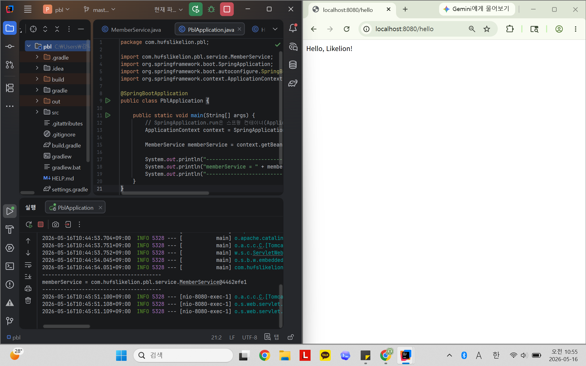
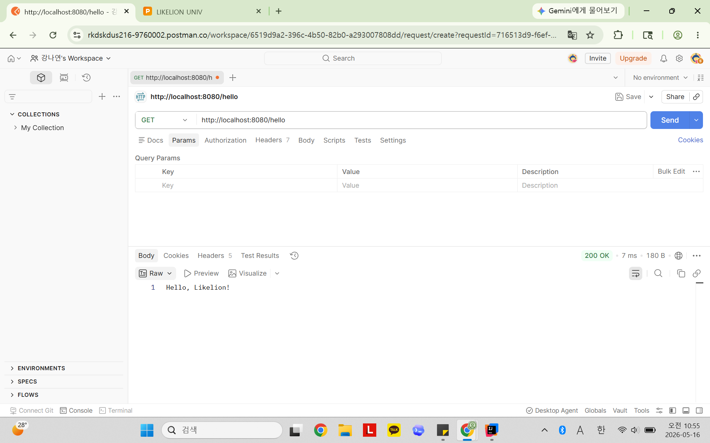

# 📘 Today I Learned
2026.05.16
  Spring Boot 전환
## 1. 오늘 배운 내용
- Spring Container(ApplicationContext)의 역할 
- Bean 등록 및 관리 방식 
- @Configuration과 @Bean을 이용한 수동 주입 방식 
- @Service, @Repository를 이용한 자동 주입 방식 
- 생성자 주입(Constructor Injection) 방식 
- @Autowired의 역할과 생략 가능한 이유 
- @RestController와 @GetMapping을 이용한 REST API 구현

## 2. 핵심 정리 (내 언어로)
1) Spring Container(ApplicationContext): 스프링에서 객체(Bean)를 생성하고 관리하는 공간
   - 기존 Java에서는 개발자가 직접 new 키워드로 객체를 생성했지만, Spring에서는 Container가 객체를 생성하고 관리한다.
2) 수동 주입 방식: 개발자가 직접 객체를 생성하고 Bean으로 등록 -> 객체 생성 과정을 명확히 확인 가능
   - @Configuration, @Bean
3) 자동 주입 방식: Spring이 자동으로 Bean 등록 -> 코드 관리와 개발 편의성이 뛰어나다
   - @Service, @Repository
4) @Autowired 생략 가능한 이유 : Spring Boot에서는 생성자가 1개만 존재하면 자동으로 의존성을 주입한다.
5) REST API: 웹에서 클라이언트와 서버가 데이터를 주고받기 위한 방식
   - Spring Boot에서는 @RestController와 @GetMapping 등을 사용하여 REST API를 쉽게 구현할 수 있다.
   - @GetMapping("/hello"): 브라우저가 /hello라는 주소로 접속(GET 요청)했을 때, 해당 메서드가 실행되도록 연결하는 이정표

## 3. 결과 이미지 (스크린샷)

### API 응답 - 브라우저에서 확인

  
### API 응답 - API 클라이언트(Postman)에서 확인

## 4. 느낀 점
- 처음에 build.gradle 설정이 잘못돼 라이브러리가 로드되지 않아서 오류들이 가득한 것을 보고 당황했다 (의존성 이름 수정으로 해결)
- 지난 과제에서는 내가 직접 객체를 생성했지만, 이번에는 Spring Container가 Bean을 관리하고 의존성을 자동으로 주입해준다는 점이 인상적이었다.
- 아직 완벽하게 숙지하진 못했지만, 어노테이션 추가만으로도 복잡한 객체 등록 과정이 생략되는 것이 흥미로웠다. 
- 'Hello, Likelion!'을 시작으로, 앞으로 더 많은 것들을 배우고 경험해볼 수 있다는 것에 기대가 된다.