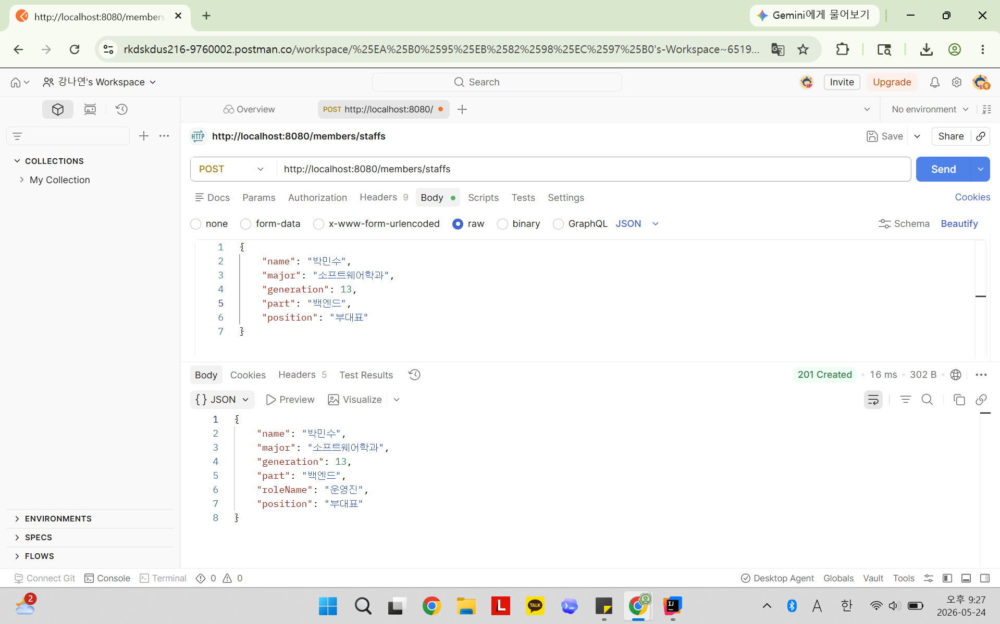
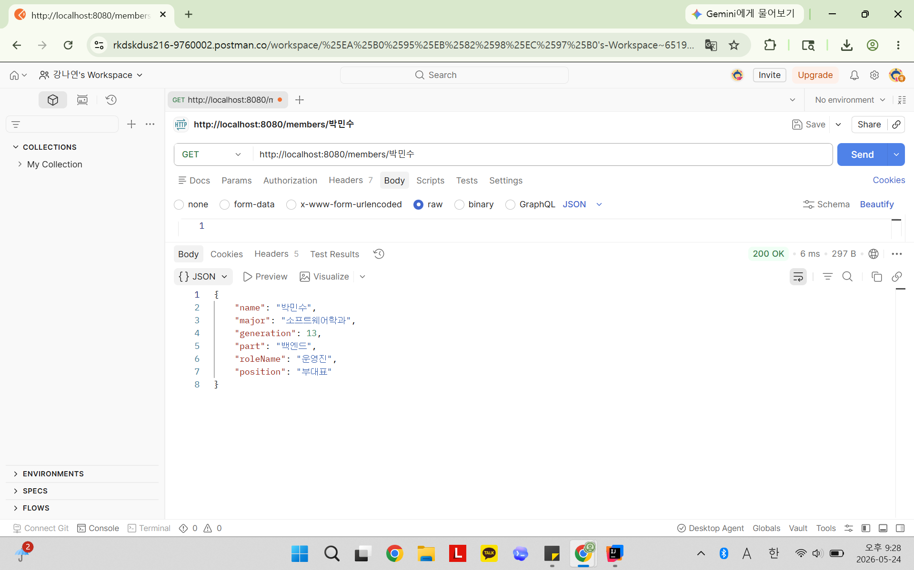
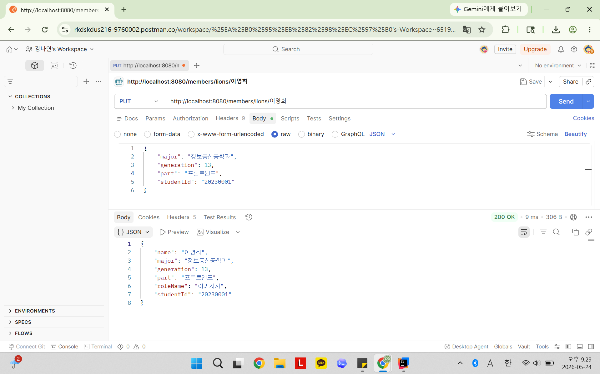
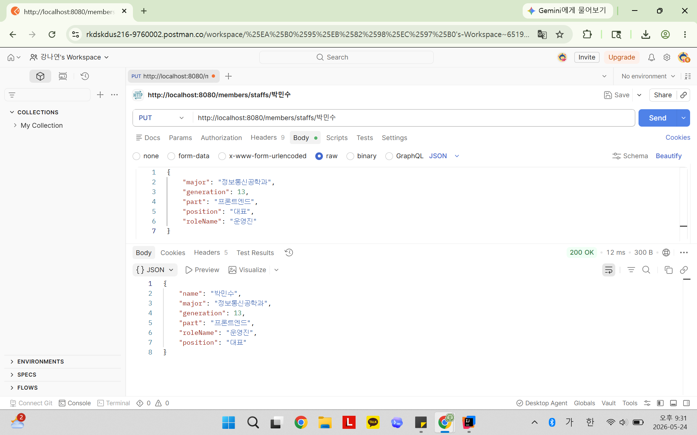
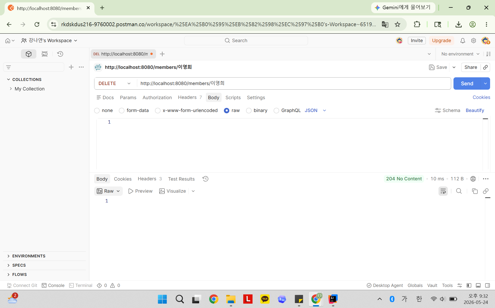
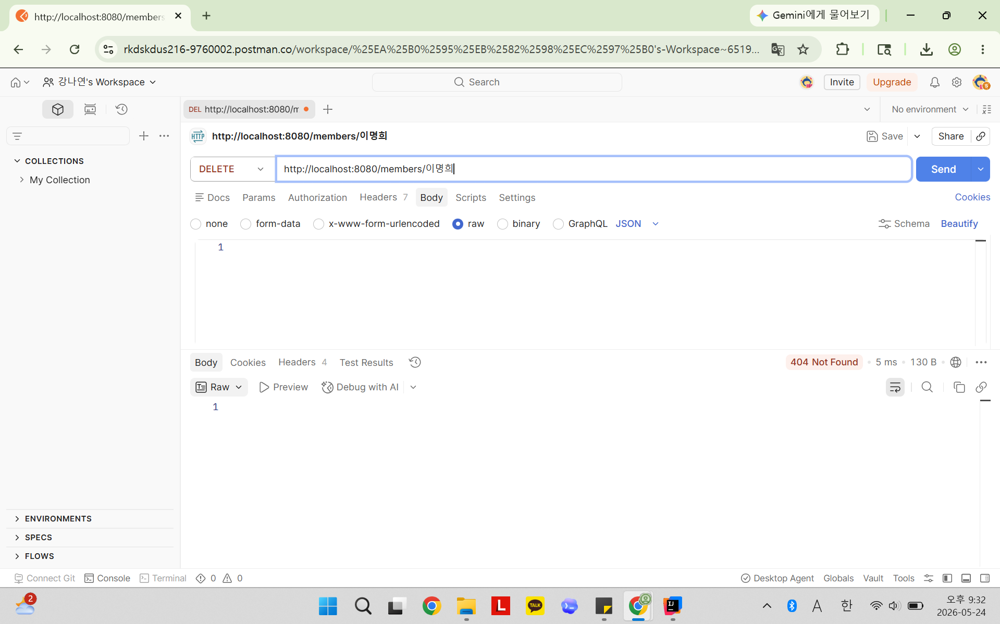

# 📘 Today I Learned
2026.05.24
  REST API 설계(CRUD)
## 1. 오늘 배운 내용
- REST API 설계 원칙
- HTTP 메서드별 역할
- HTTP 상태 코드
- @PathVariable, @RequestBody의 차이
- DTO(Data Transfer Object), 역할별로 DTO를 분리하는 이유
- ResponseEntity

## 2. 핵심 정리 (내 언어로)
1) REST API 설계 원칙 
   - 행위는 HTTP Method(GET, POST, PUT, DELETE)로 표현한다.
   - URI에는 동사를 사용하지 않는다. (ex - GET /members , POST /members/lions)
2) HTTP 메서드별 역할
   - GET : 조회
   - POST : 생성
   - PUT : 수정
   - DELETE : 삭제 
3) HTTP 상태 코드 의미
   - 200 OK : 요청 성공 
   - 201 Created : 생성 성공
   - 204 No Content : 삭제 성공
   - 404 Not Found : 데이터 없음
   - 409 Conflict : 중복 데이터
4) @PathVariable vs @RequestBody
   - @PathVariable : URL 경로의 값을 가져올 때 사용 
   - @RequestBody : 요청 JSON 데이터를 객체로 변환할 때 사용 
5) DTO(Data Transfer Object)
   - 클라이언트와 서버 간 데이터를 전달하는 객체
   - 요청(Request), 응답(Response) 데이터를 분리해서 관리
   - 역할별 DTO 분리를 통해 구조가 명확해지고 불필요한 데이터 처리를 줄일 수 있다.
6) ResponseEntity
   - 서버의 처리 결과를 HTTP 상태 코드와 함께 명확하게 전달하기 위해 사용하는 객체
   - 상태 코드와 응답 데이터를 함께 제어할 수 있다. 
   - REST API에서 상황에 맞는 응답을 명확하게 전달할 수 있다.

## 3. 결과 이미지 (스크린샷)

### 아기사자 등록

  
### 운영진 등록

  
### 이름 중복 등록시

  
### 단일 멤버 조회

  
### 없는 멤버 조회

  
### 아기사자 수정

  
### 운영진 수정

  
### 멤버 삭제

  
### 없는 멤버 삭제

## 4. 느낀점
- HTTP 메서드별 역할과 상태코드는 PBL 이전에 세션과 미프에서 자주 만났기 때문에 익숙했지만 다시 한번 실습을 통해 확실히 이해할 수 있었다.
- 상태 코드를 통해 서버의 처리 결과를 클라이언트에게 명확하게 전달할 수 있다는 점에서 REST API에서 매우 중요한 역할을 한다는 것을 느꼈다. 
- DTO를 요청/응답 목적에 따라 분리해보면서, 필요한 데이터만 안전하게 주고받을 수 있고 API 구조도 더 명확해진다는 점을 이해할 수 있었다.
