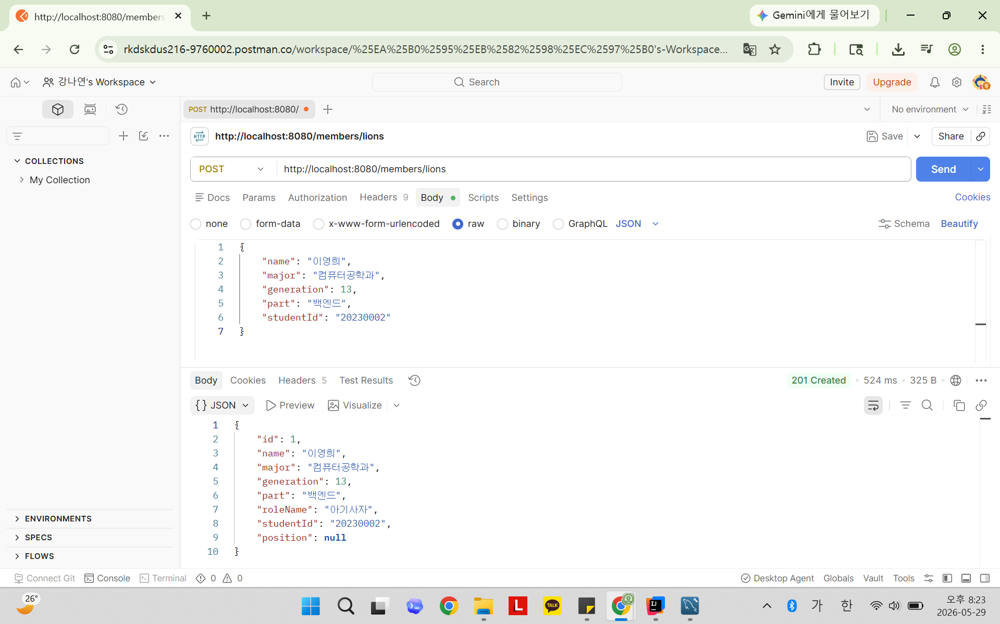
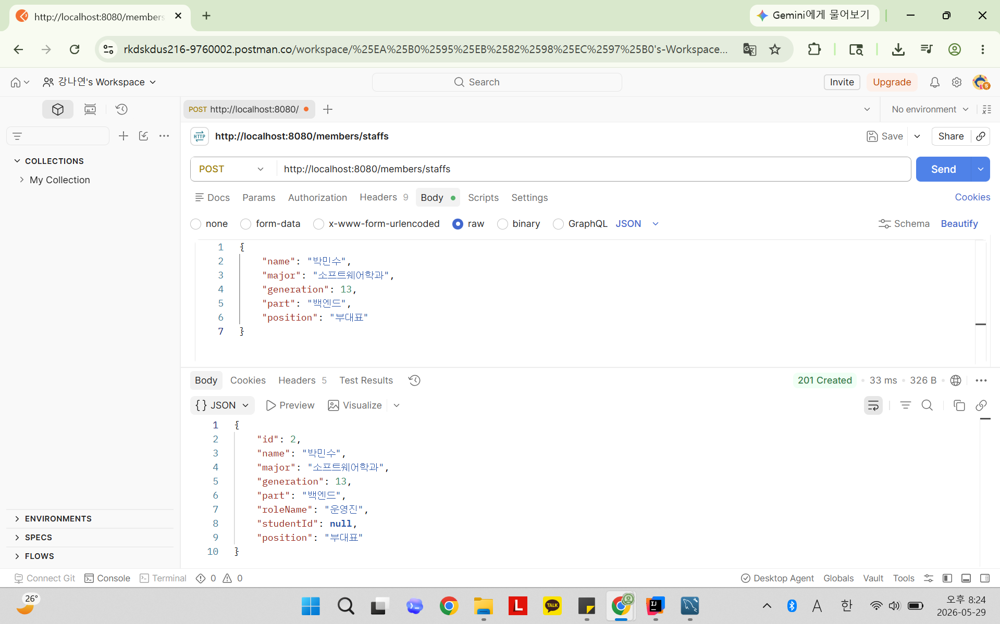
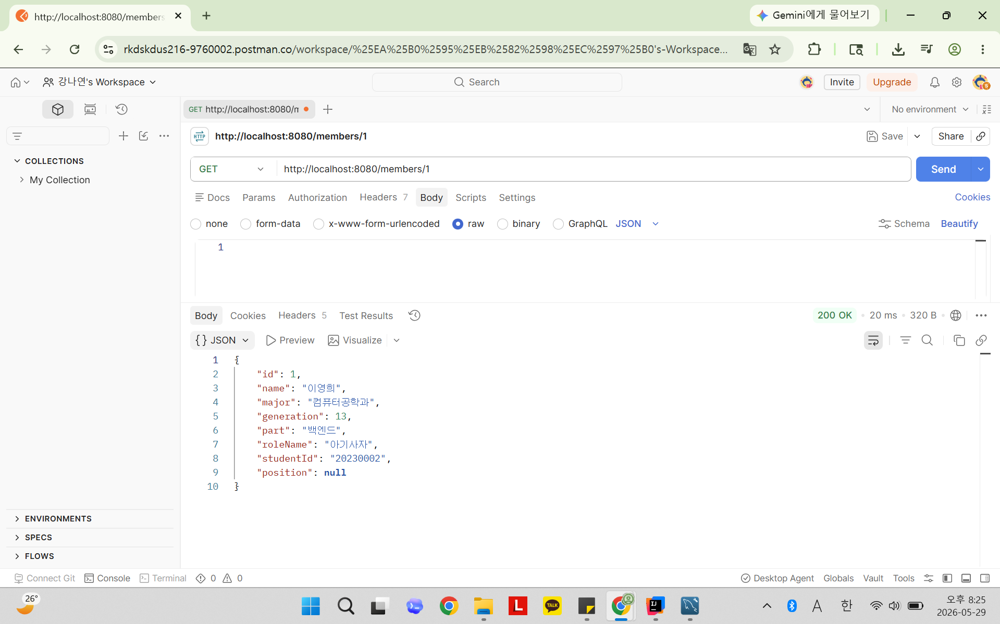
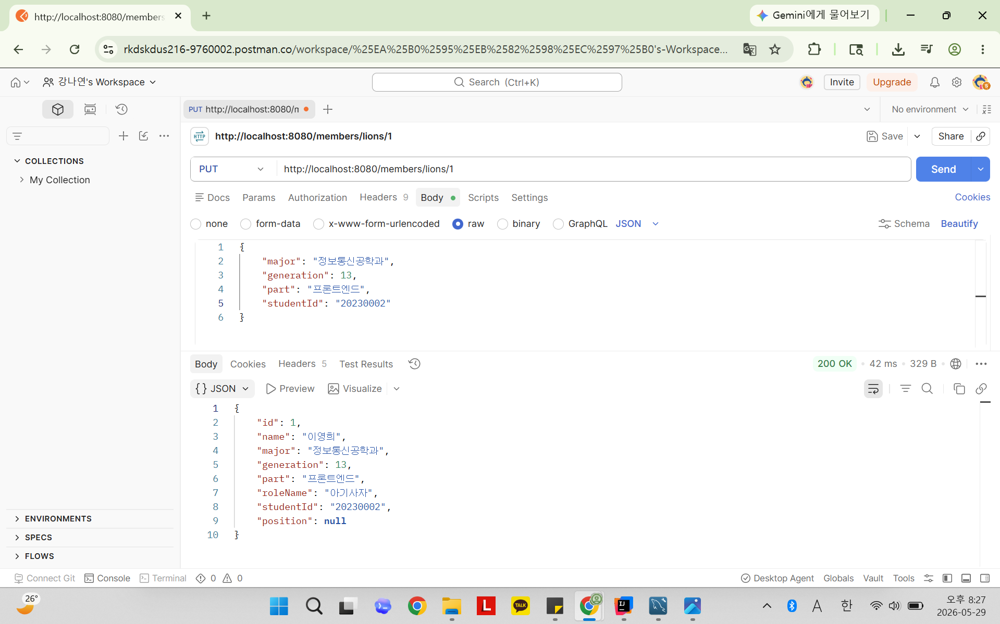
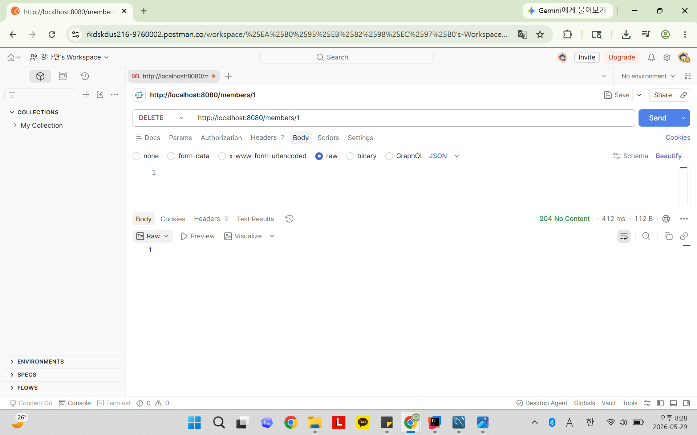
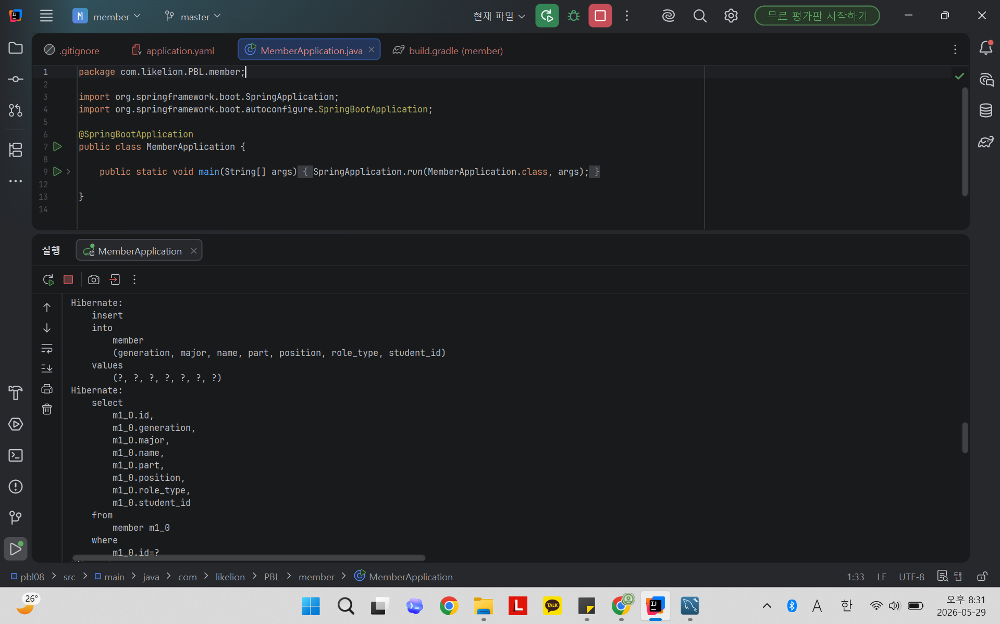
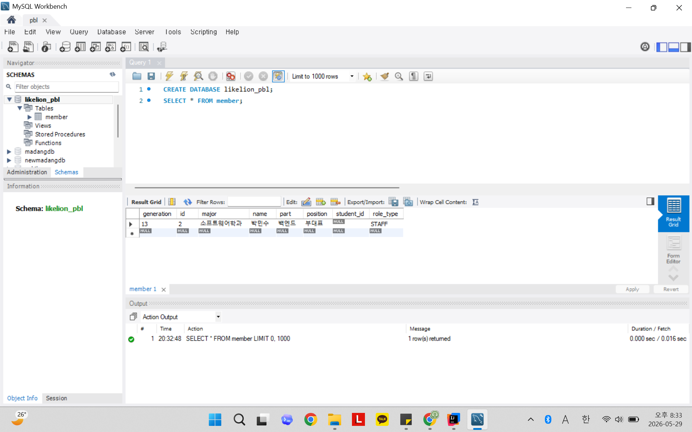

# 📘 Today I Learned
2026.05.29
  JPA 기초 & 영속성 컨텍스트
## 1. 오늘 배운 내용
- @Entity
- @Id와 @GeneratedValue(strategy = IDENTITY)의 역할
- @Enumerated(EnumType.STRING)의 역할
- JpaRepository를 상속하면 자동으로 제공되는 메서드
- findByName과 같은 쿼리 메서드 네이밍 규칙
- ddl-auto=create
- 영속성 컨텍스트, save() 호출 시 엔티티에 id가 채워지는 이유
- 콘솔에 출력되는 Hibernate SQL

## 2. 핵심 정리 (내 언어로)
1. @Entity
   - JPA가 관리하는 데이터베이스 테이블과 매핑되는 객체
   - 클래스와 DB 테이블을 연결하는 역할
   - @Entity가 있어야 JPA가 객체를 DB에 저장하고 조회 가능

2. @Id와 @GeneratedValue(strategy = IDENTITY)
   - @Id : 테이블의 기본 키(Primary Key)를 지정
   - @GeneratedValue(strategy = IDENTITY) : DB가 기본 키 값을 자동 생성
   - 데이터를 저장하면 id 값이 자동으로 생성되어 객체에 저장된다.

3. @Enumerated(EnumType.STRING)
   - Enum 타입을 문자열(String) 형태로 DB에 저장
   - Enum 이름 그대로 저장하므로 의미 쉽게 확인 가능
   - 숫자로 저장하는 방식보다 안전하고 유지보수가 쉽다.

4. JpaRepository
   - JPA에서 기본 CRUD 기능을 제공하는 인터페이스, 별도의 구현 없이 기본 기능 사용 가능
   - save() : 저장, findById() : 단건 조회, findAll() : 전체 조회, deleteById() : 삭제, existsById() : 데이터 존재 여부 확인

5. 쿼리 메서드(Query Method)
   - 메서드 이름만으로 조회 쿼리를 자동 생성하는 기능
   - findByName() : name 필드로 조회
   - findBy + 필드명 : 자동으로 조건 검색 가능

6. ddl-auto=create
   - 애플리케이션 실행 시 기존 테이블 삭제하고 새로 생성
   - 엔티티 클래스를 기준으로 테이블 자동 생성
   - 학습 및 개발 환경에서 주로 사용

7. 영속성 컨텍스트(Persistence Context)
   - JPA가 엔티티 객체를 관리하는 공간
   - save() 호출 시 엔티티를 관리하고 DB에 저장
   - DB가 생성한 id 값을 다시 객체에 넣어주기 때문에 저장 후 id가 자동으로 채워진다.

8. Hibernate SQL 로그
   - JPA가 실행하는 SQL을 콘솔에 출력해주는 기능
   - 데이터 저장 시 INSERT SQL이 출력됨
   - 데이터 조회 시 SELECT SQL이 출력됨
   - 실제 실행되는 SQL을 확인하며 JPA 동작을 이해할 수 있다.

## 3. 결과 이미지 (스크린샷)

### 아기사자 등록

  
### 운영진 등록

  
### 단일 멤버 조회

  
### 아기사자 수정

  
### 멤버 삭제

  
### 콘솔 SQL 출력 예시

  
### MySQL Workbench 확인 (등록, 수정, 삭제 후)

## 4. 느낀점
- 멋사 세션에서 배웠던 내용을 직접 구현해보는 시간이었다. 
- 그만큼 개념 자체는 익숙했지만 실제로 코드를 작성하는 과정은 생각보다 쉽지 않았다.
- 처음에는 Postman 사용이 낯설었지만, 이제는 API 테스트 과정을 익숙하게 다룰 수 있게 되었다~
