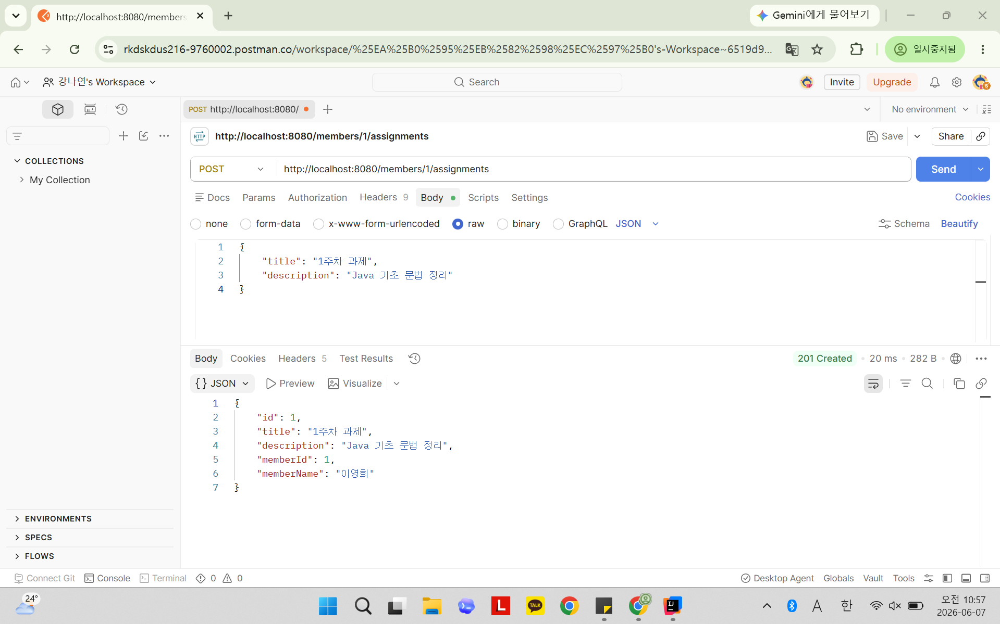
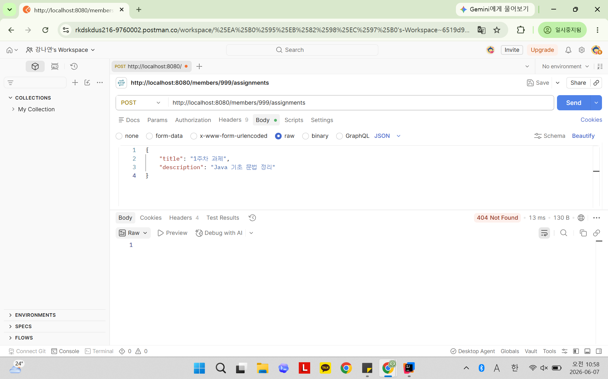
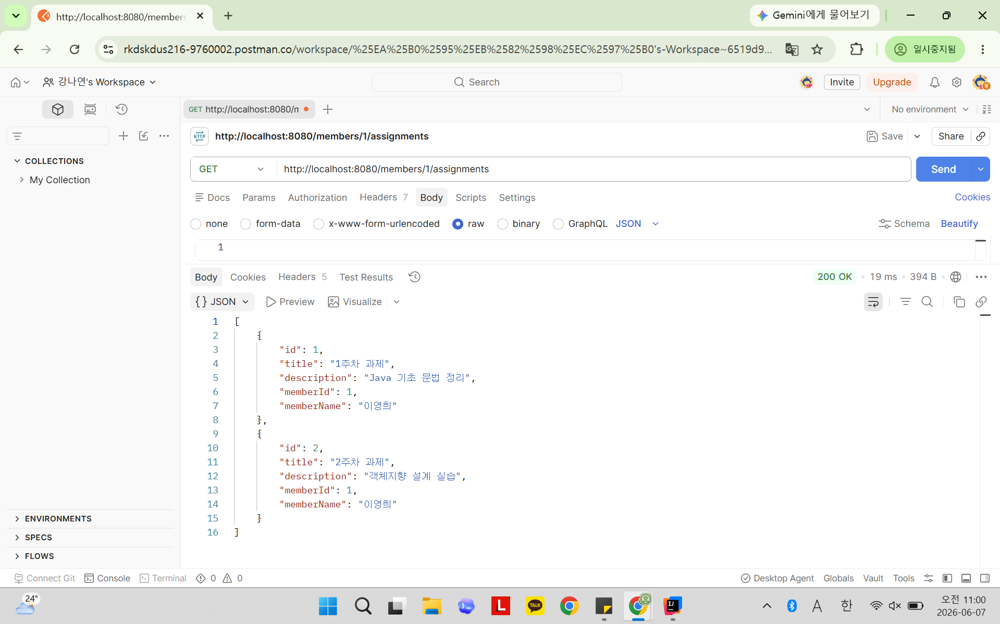
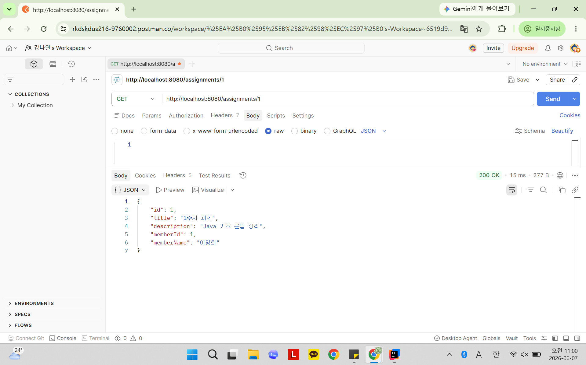
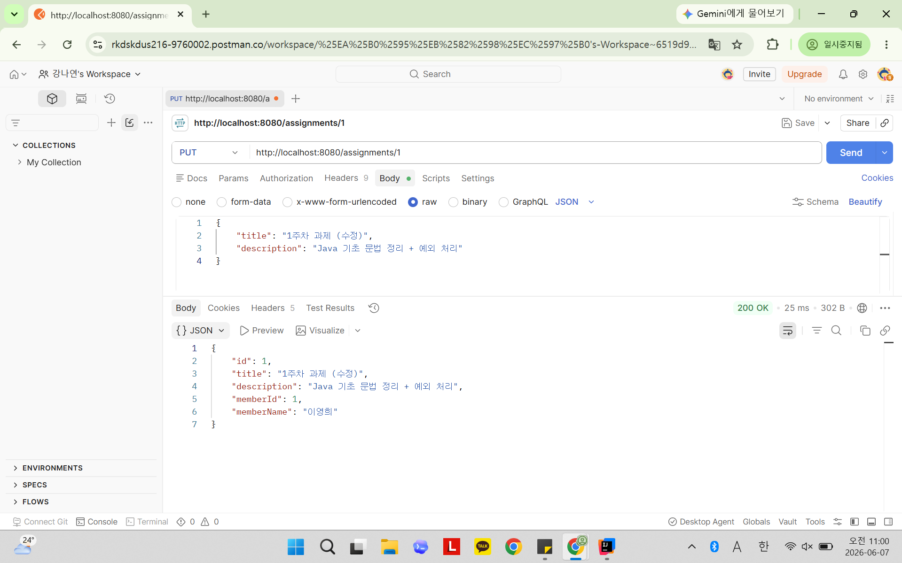
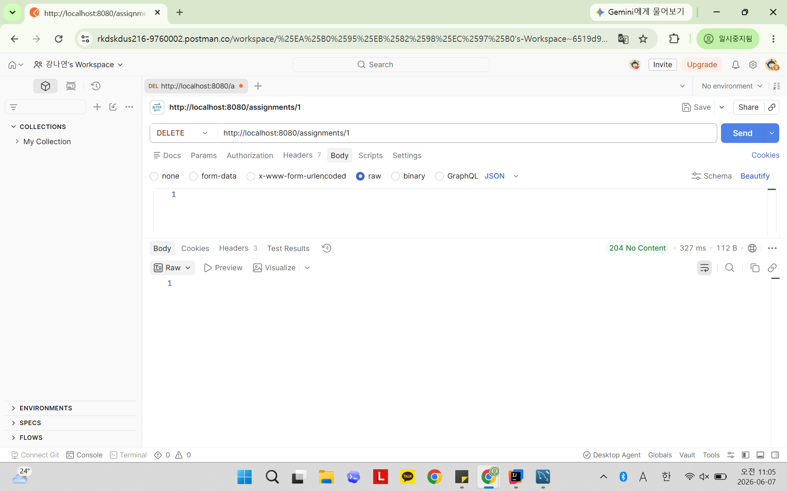
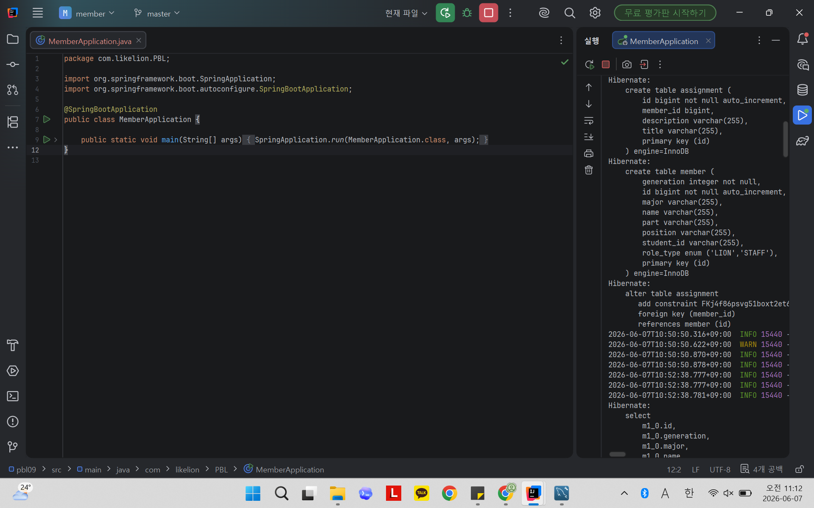
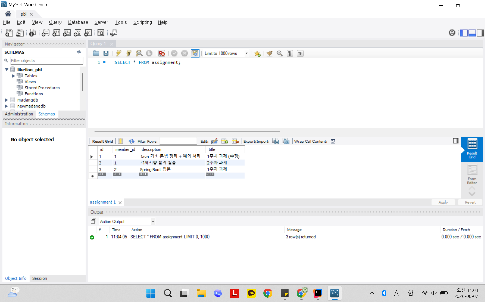
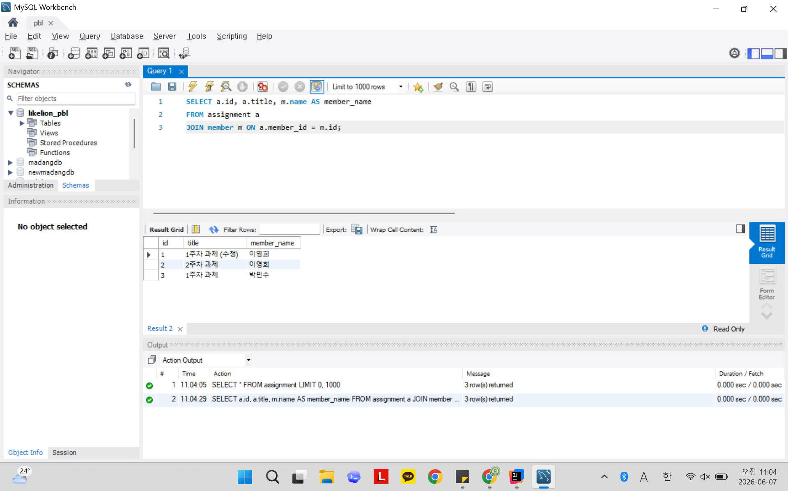

# 📘 Today I Learned
2026.06.07
  연관관계 & 트랜잭션

## 1. 오늘 배운 내용
- @ManyToOne과 @OneToMany의 역할과 차이
- 연관관계의 주인(owning side)이 무엇이고, 왜 N쪽이 주인이 되는지
- mappedBy가 무엇을 의미하는지
- @JoinColumn의 역할
- DB의 외래 키(Foreign Key)가 어떤 테이블에 생기는지
- @Transactional이 무엇이고, 서비스 계층에 붙이는 이유
- @Transactional(readOnly = true)를 조회 메서드에 사용하는 이유

## 2. 핵심 정리 (내 언어로)

1) `@ManyToOne`은 N:1 관계, `@OneToMany`은 1:N 관계를 객체로 표현할 때 사용
   - 여러 `Assignment`가 하나의 `Member`에 속하므로, `Assignment`에는 `@ManyToOne`, `Member`에는 `@OneToMany`를 사용 

2) 연관관계의 주인은 DB 외래 키를 실제로 관리하는 쪽이다. DB에서는 1:N 관계의 외래 키가 항상 N쪽 테이블에 들어간다.
   - N쪽인 `Assignment`가 연관관계 주인이 된다.

3) `mappedBy`는 “이 필드는 연관관계의 주인이 아니고, 반대편 필드에 의해 매핑된다”는 뜻 
   - `Member.assignments`에 `mappedBy = "member"`를 붙여, 실제 관계 관리는 `Assignment.member`가 한다는 것을 나타냄

4) `@JoinColumn`은 외래 키 컬럼의 이름과 매핑 정보를 지정할 때 사용
   - `Assignment.member`에 `@JoinColumn(name = "member_id")`를 붙여 `assignment` 테이블에 `member_id` 외래 키 컬럼이 생성되도록 함.

5) 1:N 관계에서는 N쪽 테이블이 1쪽 테이블의 id를 외래 키로 가진다. 
   - 여러 `Assignment`가 하나의 `Member`를 참조하므로, `assignment` 테이블에 `member_id` 외래 키가 생긴다.
   
6) `@Transactional`은 DB 작업을 하나의 트랜잭션으로 묶어 성공하면 commit, 실패하면 rollback되게 한다. 서비스 계층은 비즈니스 로직이 실행되는 곳이므로, 중간에 실패하면 전체 작업을 롤백해 데이터 일관성을 지킬 수 있다.
   - 과제 등록, 수정, 삭제와 회원 등록, 수정, 삭제가 중간에 실패해도 데이터가 어긋나지 않도록 Service 계층에 적용

7) `@Transactional(readOnly = true)`를 조회 메서드에 사용하는 이유
   - 조회 로직은 데이터를 변경하지 않으므로 읽기 전용 트랜잭션을 사용하면 변경 감지 부담을 줄일 수 있다.

## 3. 결과 이미지 (스크린샷)

### 과제 등록

  
### 존재하지 않는 멤버에게 과제 등록

  
### 멤버별 과제 목록 조회

  
### 과제 단건 조회

  
### 과제 수정

  
### 과제 삭제

  
### 콘솔 SQL 출력

### MySQL Workbench 확인

## 4. 느낀점
- Member와 Assignment의 관계를 매핑하면서 외래 키가 어디에 생기는지, 연관관계의 주인이 왜 N쪽인지 이해할 수 있었다.
- `ddl-auto: create` 설정으로 인해 서버 재실행 시 데이터가 초기화되는 상황을 직접 경험하며 해당 설정을 이해할 수 있었다.