# 📘 Today I Learned
2026.06.21
  개인 미니 프로젝트: 예외 처리 통합 & 프론트엔드 연동

## 1. 오늘 배운 내용
- @RestControllerAdvice
- @ExceptionHandler
- 커스텀 예외
- Service에서 null을 반환하는 방식과 예외를 던지는 방식의 차이
- Spring Data JPA의 쿼리 메서드 네이밍 규칙으로 검색 기능을 구현하는 방법
- 프론트엔드에서 fetch()로 백엔드 API를 호출하고, JSON 응답을 받아 화면에 렌더링하는 흐름

## 2. 핵심 정리 (내 언어로)

1) `@RestControllerAdvice`는 컨트롤러마다 반복되는 예외 처리 코드를 줄이고, 에러 응답 형식을 일관되게 관리하기 위해 사용한다.

2) `@ExceptionHandler`는 예외가 던져졌을 때 Spring이 예외 타입을 비교해 가장 알맞은 처리 메서드를 찾아 실행하는 방식으로 동작한다.

3) 커스텀 예외를 사용하면 단순한 `RuntimeException`보다 어떤 문제가 발생했는지 클래스 이름만으로도 파악하기 쉽다.

4) `null` 반환 방식은 정상 흐름과 실패 흐름이 섞이기 쉽고, 예외 방식은 실패 상황을 별도의 흐름으로 분리해 책임을 명확하게 만든다.

5) Spring Data JPA에서는 `findByPart`, `findByTitleContaining`처럼 메서드 이름에 필드명과 조건 키워드를 조합해 검색 기능을 구현할 수 있다.

6) `fetch()`는 요청 URL, HTTP 메서드, 헤더, body를 설정해 서버와 통신하고, 응답 JSON을 JavaScript 객체로 변환해 화면에 표시한다.

7) CRUD와 HTTP 메서드는 Create-POST, Read-GET, Update-PUT, Delete-DELETE처럼 대응시켜 REST API를 설계할 수 있다.

## 3. 결과 이미지 (스크린샷)

### 존재하지 않는 멤버 조회
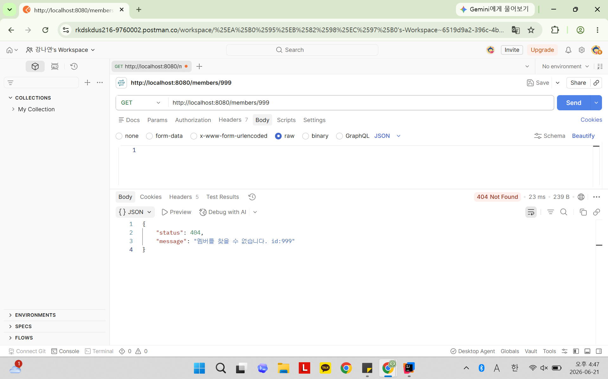
  

### 중복이름으로 멤버등록
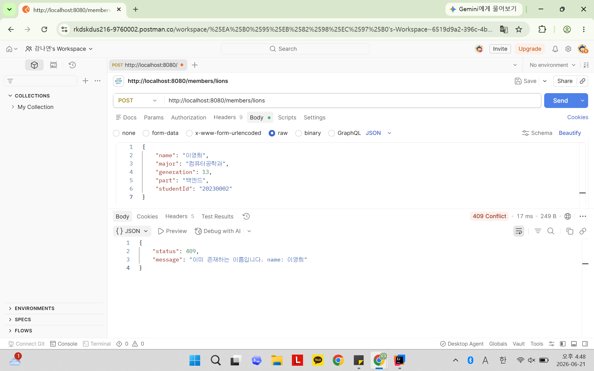
  

### 존재하지 않는 과제 수정
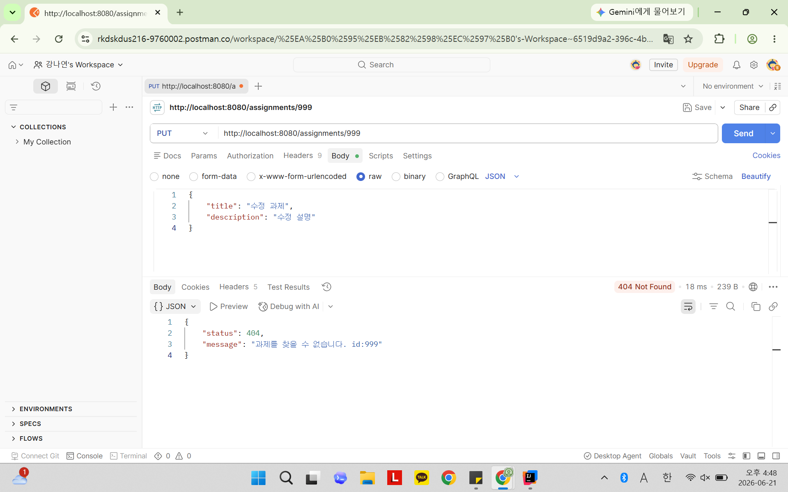
  

### 전체 과제 조회
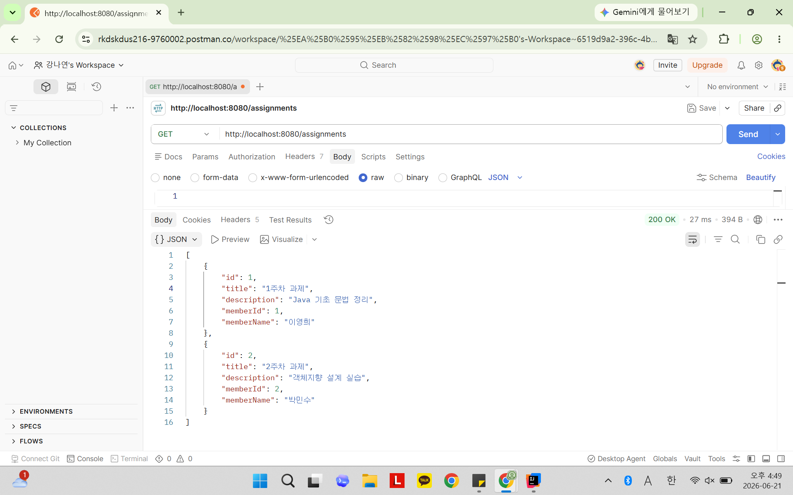
  

### 파트별 멤버 필터링
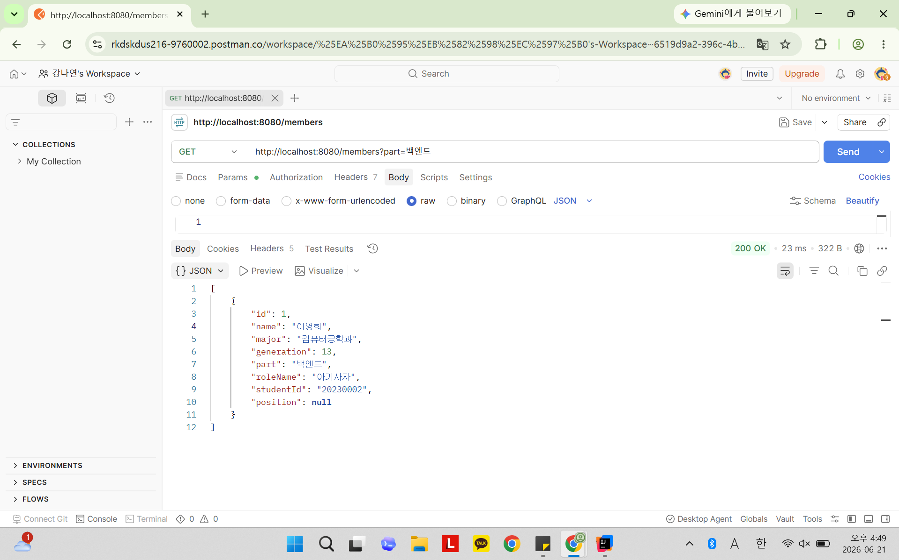
  

### 과제 제목 검색
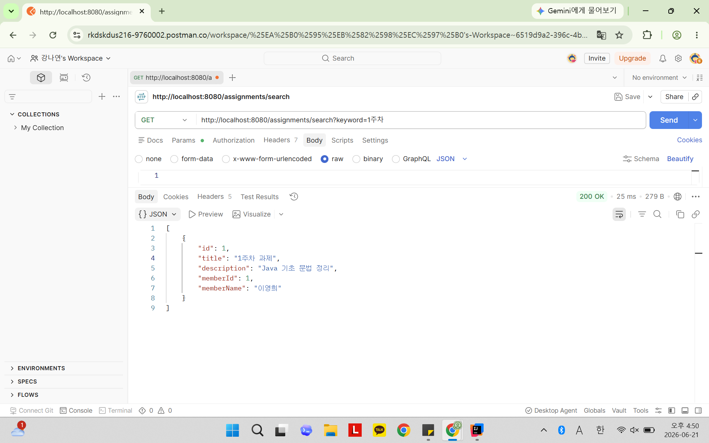
  

### 브라우저- 멤버 등록
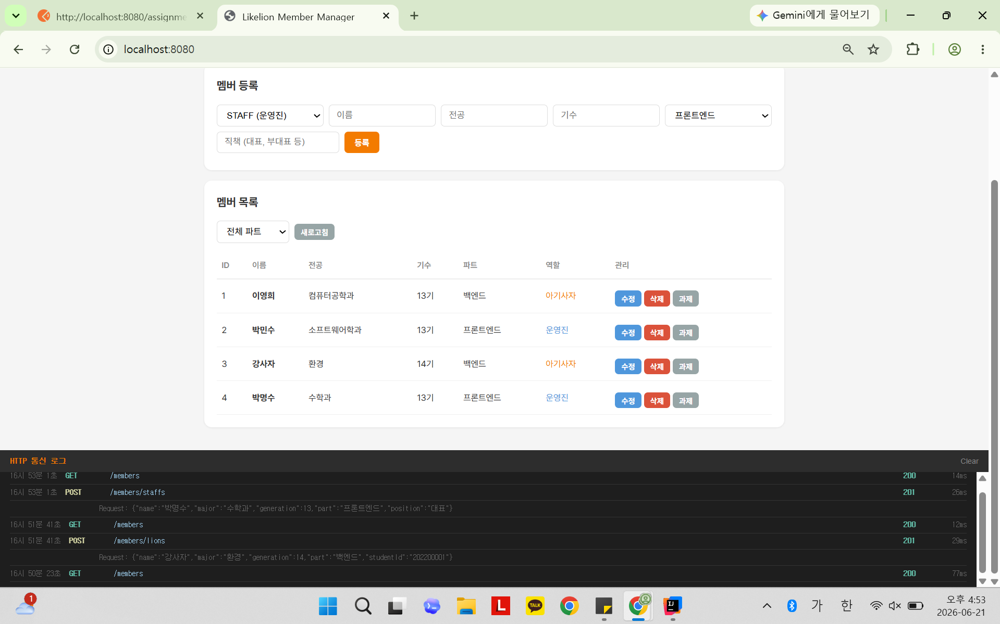
  

### 브라우저- 멤버 수정
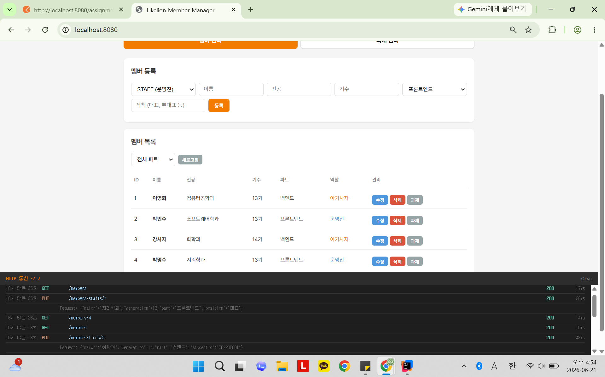
  

### 브라우저- 멤버 삭제
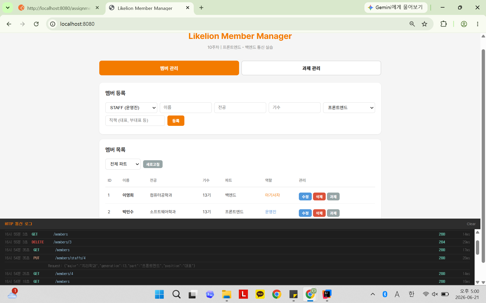
  

### 브라우저- 과제 등록 및 전체 조회
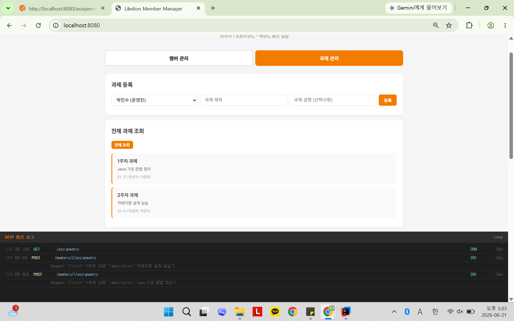
  

### 브라우저- 과제 멤버별,단건 조회
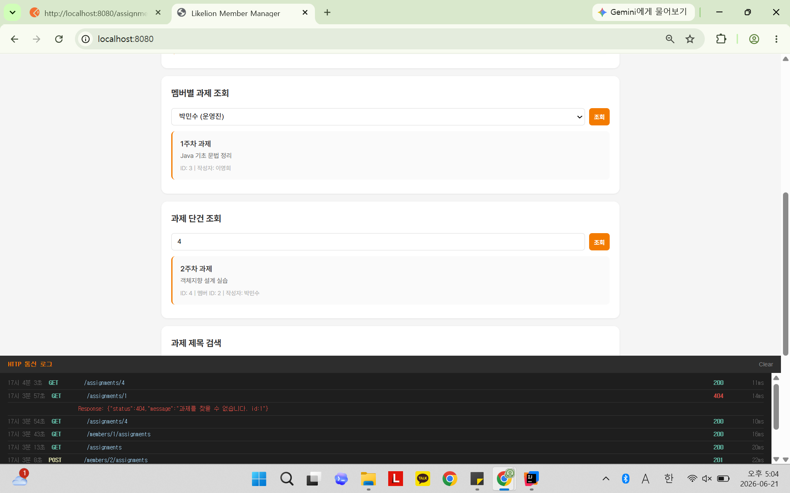
  

### 브라우저- 과제 제목 조회,수정,삭제
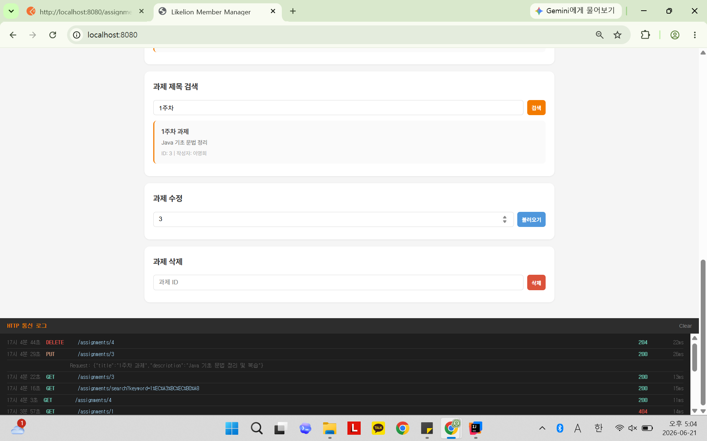

## 4. 느낀점
- 예외 처리를 Controller마다 작성하는 것보다 전역에서 관리하면 코드가 훨씬 깔끔해지고, 에러 응답 형식도 통일된다는 점을 느꼈다.
- Service에서 `null`을 반환하는 방식보다 예외를 던지는 방식이 실패 상황을 더 명확하게 표현할 수 있다는 것을 알게 되었다.
- 프론트엔드 화면에서 직접 API 요청과 응답 로그를 확인하면서, 백엔드와 프론트엔드가 JSON으로 통신하는 흐름을 더 잘 이해할 수 있었다.
